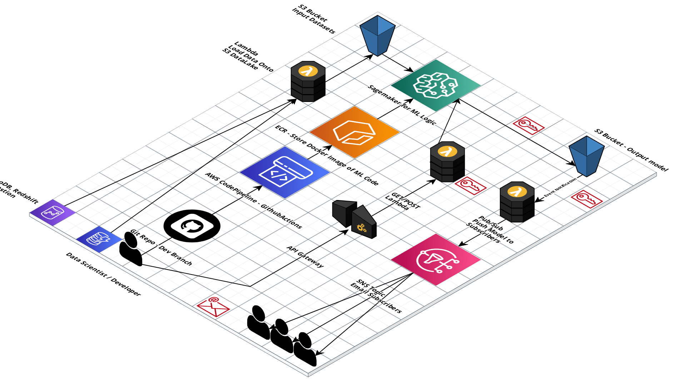
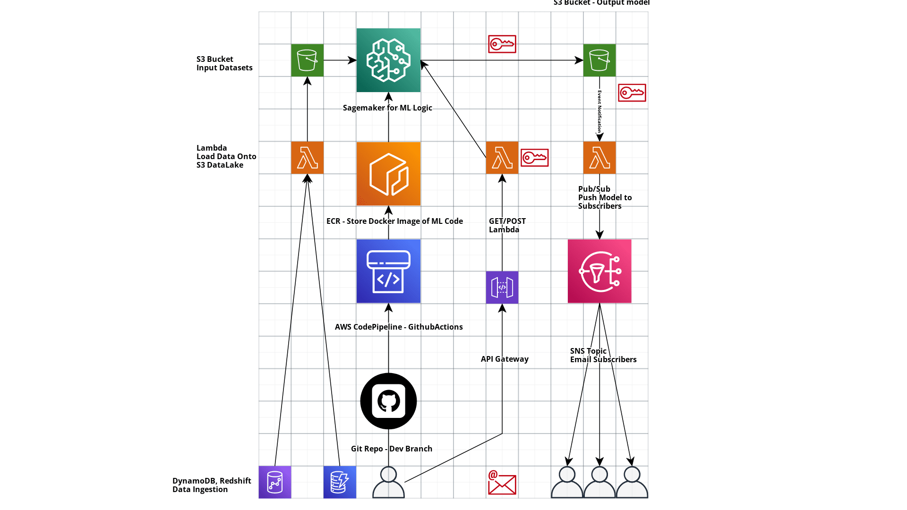

# AWS Sagemaker with CI/CD

## ML OPS CI/CD Pipeline (AWS)

- Github // Gitlab // AWS CodePipeline for source control - “*Develop relevant repository structure to setup CI/CD pipeline*”
- Use Cloudformation // CDK // Terraform for IaC - *“Implement Environment (deploying services using Terraform)*”
- Redshift // S3 - *“Ingest data from different sources, CSV, JSON, TXT, SQL, IMAGES”*
- Vertex AI // AWS Sagemaker for ML Business Logic - *“Use Sagemaker or relevant services for ML logic"*
- Docker // ECR // Kubernetes - Deployment and Consistency
- AWS Step Functions // CodePipeline - Orchestrate workflow and Visualize CI/CD Pipeline *“Expose relevant API and services for so data to be easily consumed by business applications, including the Dashboard platform, industrialized Data Science platforms, business user tools, and external applications, by providing Data Marts, APIs, and a Publish and Subscribe service.”*

# Issues:

1. API gateway multiple instances
2. add redshift/kinesis support
3. on predict serve.py is called